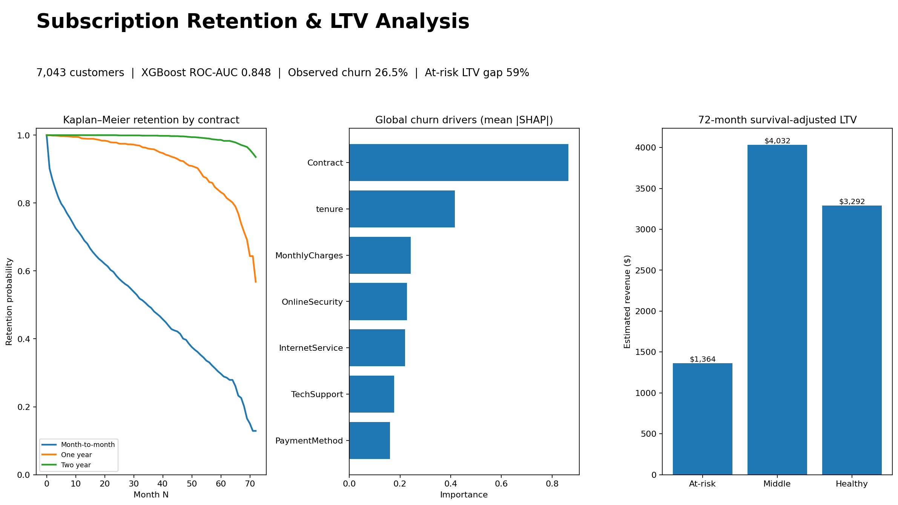

# Subscription Retention & LTV Analysis

Customer retention and lifetime value analysis built on the IBM Telco Customer Churn dataset. The project combines DuckDB SQL, feature engineering, logistic regression, XGBoost, SHAP, Kaplan–Meier survival analysis, and a Streamlit dashboard.



## 1. Business problem

The analysis examines churn patterns, retention differences across customer segments, model-based churn risk, and survival-adjusted revenue estimates.

This project answers four business questions:

- Which customer attributes are most associated with churn?
- How does retention differ across contract and service cohorts?
- How much 72-month revenue LTV is associated with high-risk versus low-risk customers?
- Which individual customers should a retention team review first, and what model signals explain each score?

The source is the IBM Telco Customer Churn sample: **7,043 customer rows** with tenure, contract type, service adoption, payment method, charges, and observed churn status. The overall observed churn rate is **26.5%**.

> **Dataset limitation:** this dataset is a one-time customer snapshot rather than monthly billing history, so calendar signup-month retention cohorts are not available. The project uses Kaplan–Meier survival estimates grouped by contract, internet service, and model risk segment. See `docs/METHODOLOGY.md`.

## 2. Analytics and modeling

### DuckDB layer

`sql/` builds a reproducible warehouse layer with cleaned customer features and reusable EDA views. The retention SQL calculates monthly at-risk populations, churn events, hazards, and survival probabilities by contract cohort.

### Feature engineering

The model adds:

- tenure buckets: 0–6, 7–12, 13–24, 25–48, 49–72 months
- active service count
- automatic-payment indicator
- fixed monthly-charge bands
- cleaned numeric total charges

### Churn models

A stratified 80/20 holdout split compares an interpretable logistic-regression baseline with XGBoost.

| Model | ROC-AUC | Accuracy | Precision | Recall | F1 |
|---|---:|---:|---:|---:|---:|
| Logistic regression | 0.845 | 0.740 | 0.506 | 0.802 | 0.620 |
| XGBoost | **0.848** | **0.808** | **0.673** | 0.535 | 0.596 |

SHAP is used for both global feature importance and row-level explanations in the dashboard. The strongest global signals are **contract type**, **tenure**, and **monthly charges**.

### Survival-adjusted LTV

Churned customers are treated as events at observed tenure; active customers are right-censored. The project implements Kaplan–Meier estimation directly and calculates restricted mean survival time through month 72.

`estimated LTV = average monthly charge × 72-month restricted expected tenure`

This is intentionally a simple gross-revenue LTV, not contribution margin. CAC, discounting, servicing costs, and upsell are outside scope.

## 3. Key findings

**Contract type shows the strongest observed association with churn.** Month-to-month customers show **42.7%** observed churn compared with **2.8%** for two-year customers. Contract type is also the strongest aggregated SHAP feature.

**Observed churn is highest among customers with shorter tenure.** Customers with 0–6 months of tenure show **52.9%** observed churn versus **9.5%** among customers with 49–72 months.

**Churn rates also vary by payment method.** Electronic-check customers show **45.3%** observed churn. This result is treated as an association rather than evidence of causality.

**Estimated LTV differs substantially across model risk segments.** Under the 72-month Kaplan–Meier horizon, the model-defined high-risk quartile has estimated LTV of **$1,364**, about **59% lower** than the low-risk quartile at **$3,292**.

## 4. Dashboard and repository structure

The Streamlit dashboard provides:

- Kaplan–Meier retention curves and a retention heatmap by cohort dimension
- global SHAP churn-driver chart
- survival-adjusted LTV comparison
- top 20 at-risk customers
- per-customer SHAP explanation strings showing the three largest model contributions
- summary metrics and findings

```text
subscriber-retention/
├── artifacts/                 # model outputs, scores, SHAP, LTV, dashboard preview
├── dashboard/app.py           # Streamlit application
├── data/raw/                  # IBM Telco CSV + source note
├── docs/                      # methodology and deployment guidance
├── notebooks/                 # EDA notebook
├── scripts/                   # warehouse/model/dashboard build scripts
├── sql/                       # DuckDB feature, retention, and EDA SQL
├── src/retention_ltv/         # reusable Python package
├── tests/                     # feature + survival tests
├── Makefile
└── requirements.txt
```

## 5. Run locally and deploy

```bash
git clone https://github.com/Gopal3746/subscriber-retention.git
cd subscriber-retention

python3 -m venv .venv
source .venv/bin/activate
pip install -r requirements.txt

make build
make test
make app
```

`make build` loads the raw CSV into DuckDB, builds SQL views/tables, trains both classifiers, writes SHAP and survival/LTV artifacts, and refreshes the dashboard preview.

For Streamlit Community Cloud, push the repository to GitHub and use `dashboard/app.py` as the app entrypoint. The app reads committed precomputed artifacts, which keeps cloud startup lightweight. See `docs/DEPLOYMENT.md`.


### Data source

The repository includes the IBM Telco Customer Churn sample for reproducibility. A public GitHub mirror was used to retrieve the 7,043-row CSV; see `data/raw/SOURCE.md` for provenance.
